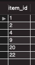

# MySQL
***
### WHY?
- MySQL을 활용하기 위한 메모
***
### HOW?
- MySQL을 사용하면서 유용한 내용들을 순서에 상관없이 메모
***
<br>

* Primary key
<br>
특정 컬럼을 Primary key로 설정하면 Primary key와 같은 값이 있는 row가 추가되는 것을 <br>DBMS가 자동으로 막아준다.
<br><br>
  - Primary key의 종류
  1. Natural key<br>
  실제 어떤 개체가 갖고 있는 속성을 나타내는 컬럼이 Primary key가 됐을 때 이를
  Natural key라고 한다.<br><br>
  2. Surrogate Key<br>
  데이터의 속성을 직접적으로 나타내는 컬럼이 아닌 Primary key로 사용하기 위해 추가한 컬럼을 <br> Surrogate key라고 한다.
***
<br>

###  연도(YEAR) 구하기
<br>

```
WHERE YEAR(column) = '1995';
```
* column열에 있는 연도(year)의 1995가 있는 데이터 추출
  ##### 이 밖에 MONTH, DAYOFMONTH를 사용하여 월, 일을 추출하여 데이터를 추출 할 수 있다.
<br><br>
### 월(MONTH) 구하기
<br>

```
WHERE MONTH(column) IN (6, 7, 8);
```
* column 열에 있는 월(month)의 6, 7, 8에 해당하는 데이터 추출
<br><br><br>

### 일(DAYOFMONTH) 구하기
<br>

```
WHERE DAYOFMONTH(column) BETWEEN 15 AND 31;
```
* column 열에 있는 일(day)에서 15부터 31까지의 데이터 추출
<br><br><br>

### 날짜 간 차이 구하기
<br>

```
DATEDIFF(A, B);
```
* A와 B 날짜의 차이를 확인
<br><br>

### 오늘 날짜 구하기
<br>

```
CURDATE();
```
* 오늘 날짜를 확인
<br><br>

### 날짜 더하기
<br>

```
DATE_ADD(column, INTERVAL 300 DAY);
```
* column 날짜에서 300일 만큼 더하기
<br><br>

### 날짜 빼기
<br>

```
DATE_SUB(column, INTERVAL 300 DAY);
```
* column 날짜에서 300일 만큼 뺴기
<br><br>

### 대소문자 구분하기
<br>

```
WHERE column LIKE BINARY '%g%';
```
* BINARY를 사용하면 대소문자를 구분하여 어떤 문자열 사이에 소문자 'g'가 있는 문자열만 추출
  ##### BINARY는 해당 문자열이 컴퓨터에서 인식하는 '0'과 '1'이 정확히 일치하는 것을 찾으라는 의미
<br><br>

### 정렬하기
<br>

#### 문법 상 'ORDER BY' 절은 'WHERE' 뒤에 나와야 함
<br>

```
ORDER BY column ASC;
```
* column열을 가장 작은 값(ASC : 오름차순)부터 정렬
<br>

```
ORDER BY column DESC;
```
* column열을 가장 큰 값(DESC : 내림차순)부터 정렬
<br><br>

### TEXT타입 열 정렬하기
<br>

```
ORDER BY CAST(column AS signed) ASC;
```
* column열의 타입을 signed라는 데이터 타입으로 변경
  ##### signed type -> 양수와 음수를 포함한 모든 정수를 나타낼 수 있는 타입
<br>

*****
<br>

### 출력 개수 제한하기
<br>

```
ORDER BY column ASC LIMIT 10;
```
* column열을 10개만 추려서 오름차순으로 정렬
<br>

```
ORDER BY column ASC LIMIT 10, 2;
```
* column열을 10번째 이후 2개만 추려서 오름차순으로 정렬
<br><br>

### row 개수 구하기
<br>

```
SELECT COUNT(column) FROM table_name;
```
* 해당 column에서 값이 있는 row의 개수 확인
  ##### NULL의 개수는 제외하고 개수를 알려줌<br>
  ##### COUNT(*)를 사용하면 절대 row개수를 알 수 있음
<br>

### 최대값 구하기

```
SELECT MAX(column) FROM table_name;
```
* 해당 column에서 가장 큰 값을 확인
  ##### 마찬가지로 MIN()를 사용하면 최소값을 알 수 있음
<br>

### 평균 값 구하기

```
SELECT AVG(column) FROM table_name;
```
* 해당 column의 평균값을 확인
  ##### NULL값은 제외하고 평균값을 추출함

#### [MySQL 산술함수 공식 Documentation](https://dev.mysql.com/doc/refman/8.0/en/mathematical-functions.html)

<br><br>

### NULL값 찾기
<br>

```
WHERE column IS NULL
```
* column에 NULL값이 있는 row를 확인
  ##### 값이 있는 row를 구하려면 NOT NULL을 입력
<br>

### 하나라도 NULL값이 있는 row 구하기
<br>

```
WHERE column1 IS NULL
  OR column2 IS NULL
  OR column3 IS NULL:
```
* column1, 2, 3 중에 NULL값이 있는 모든 row 값 확인
<br><br>

### NULL값을 다른 이름으로 출력하기
<br>

```
SELECT
  COALESCE(column1, '비어있음'),
  COALESCE(column2, '비어있다')
FROM table_name;
```
* column1에서 값이 있다면 그대로 출력하고, NULL값이면 '비어있음'으로 치환하여 출력
  ##### IFNULL(column1, 'name')의 방법으로 동일하게 치환이 가능함. 하지만 IFNULL함수는 파라미터를 2개만 넣을 수 있으며, <br>COALESCE함수는 표준 SQL함수이므로 COALESCE함수를 사용하는 것을 권장
<br><br>

### COALESCE 응용하기
<br>

```
SELECT COALESCE(column1, column2, 'N/A') FROM table_name;
```
* column1의 값이 있다면 그대로 출력, 값이 NULL값이면 column2값을 출력, 이 마저도 NULL값이면 N/A로 출력
<br>

****

### column이름 Alias 하기
<br>

```
SELECT column AS name;
```
* column 이름을 name으로 변경하여 보여줌
  ##### column이름 뒤에 space를 하고 Alias 이름을 적어도 되지만 가독성을 위해 'AS'를 붙이는 것을 권장<br> * 띄어쓰기가 포함 된 Alias를 할 때 작은따옴표나 큰 따옴표를 붙여 Alias 부분을 확실하게 표현해주어야 함
<br><br>

### column을 합치고 단위 등을 붙이기
<br>

```
CONCAT(column1, 'name1', ', ', column2, 'name2') AS name3;
```
* Concatenate(연결하다)의 약자로, column1의 값에 name1을 붙이고 column2의 값에 name2를 붙여<br> name3의 이름으로 된 합쳐진 column으로 보여줌
<br>

***
<br>

### CASE문
<br>

```
CASE
  WHEN column 조건 THEN 'result1'
  WHEN column 조건 THEN 'result2'
  ELSE 'result3'
END
```
* column의 조건에따라 result를 확인. 보면 다른 언어의 if문과 비슷한 구조임.
<br><br>
***

### 고유값 추출하기
<br>

```
SELECT DISTINCT(column) FROM table_name;
```
* 해당 column에서 고유한 값들을 출력
  ##### 만약, 성별을 나타내는 column이라면 Male, Female값이 나옴
<br>

```
SELECT DISTINCT(SUBSTRING(column, 1, 2)) FROM table_name;
```
* SUBSTRING을 위와 같이 사용하면 column의 첫번째, 두번째 TEXT를 가져온다.
  ##### 그리고 위 코드는 DISTINCT로 SUBSTRING을 덮어주어 고유값만 가져오는 것이다.
<br>

***

### 공백 지우기
<br>

```
SELECT TRIM(column) FROM table_name;
```
* column 값의 양쪽 공백을 지워줌
  ##### LTRIM을 사용하면 왼쪽 공백을, RTRIM을 사용하면 오른쪽 공백을 지워준다.
<br>

***

### 그루핑(GROUP) 하기
<br>

```
SELECT * FROM table_name GROUP BY column;
```
* column을 그루핑 하여 중복되는 값을 합쳐줌
  ##### 그루핑을 하면 SELECT문에는 그루핑 한 column들만 사용할 수 있고 <br> COUNT, MAX 등 집계함수만 사용이 가능하다.

```
SELECT COUNT(*) FROM table_name GROUP BY column;
```
* 위와 같이 실행하면 해당 column의 그루핑 된 row의 갯수를 알려줌
<br>

***

### GROUP BY 된 값에 조건 걸기
<br>

```
GROUP BY column
HAVING column = '의정부'
```
* column의 값이 의정부인 row만 조회함.
<br><br>

### 부분 총계값 구하기
<br>

```
GROUP BY column1, column2
WITH ROLLUP
```
* column1과 2중에 먼저 그루핑을 한 상위 column인 column1을 기준으로 총계 값을 출력
<br>

***
<br>

### 결합 연산 사용하기
<br>

```
FROM table1 LEFT OUTER JOIN table2
ON column1 = table2.column2
```
* 왼쪽 테이블 인 table1을 기준으로 table2가 합쳐지며, column1을 table.column2에 합치라는 명령.

```
FROM table1 AS a LEFT OUTER JOIN table2 AS b
USING(id)
```
* column의 이름이 같다면 USING을 사용하여 JOIN의 조건을 표현할 수 있음.
<br>

### Table간 교집합 합치기
<br>

```
FROM table1 INNER JOIN table2;
```
* 좌우에 기준이 되는 테이블 없이 테이블을 합쳐줌
<br>

> JOIN은 가로 방향을 합치는 결합 연산에 해당된다.
<br>

### 집합 연산 사용하기
<br>

```
SELECT * FROM table1
INTERSECT
SELECT * FROM table2
```
* table1, 2의 교집합에 해당되는(column이 똑같으며 내용도 일치하는) row 합치기
<br>

```
SELECT * FROM table1
MINUS
SELECT * FROM table2
```
* table1에서 table2를 뺀 차집합에 해당되는 row 합치기
  ##### 반대로 table2에서 table1을 빼려면 순서만 바꿔주면 된다.
<br>

```
SELECT * FROM table1
UNION
SELECT * FROM table2
```
* table1, 2의 합집합(모든 row)를 합치기
  ##### UNION을 사용하면 두 table이 공통적으로 갖고있는 원소(교집합에 속하는 원소들)는 중복을 제거하고 하나만 표시됨.<br> 중복되는 원소들도 모두 표시하려면 UNION ALL을 사용하면 됨
<br>
***

### 서브쿼리(Sub query) 사용하기
<br>

```
(SELECT column FROM table)
```
* 위와 같이 SQL문을 괄호로 감싸주면 됨.
  ##### 서브쿼리를 사용했을 때 해당 서브쿼리의 값을 활용할 수 있음
<br>

### 서브쿼리를 활용하여 id값 구하기
<br>

```
SELECT * FROM item
WHERE id IN
(
SELECT item_id
FROM review
GROUP BY item_id HAVING COUNT(*) >= 3
);
```

<br>
* 서브쿼리의 결과는 위와같고, 해당 서브쿼리의 값을 IN으로 가져온다.
<br>

***

### VIEW 저장하기
<br>

```
CREATE VIEW name AS
SELECT ~~
FROM ~~;
```
* AS 뒤의 SQL함수를 name으로 저장하여 다른 쿼리창에서 쓸 수 있음.
<br>

### 테이블 생성하기
<br>

```
CREATE TABLE `name`;
```
* name의 이름으로 table이 생성된다.
  ##### 내가 설정한 이름에는 무조건 `(백틱)을 쓰도록 한다.
<br>

### column 생성하기
<br>

```
CREATE TABLE `name`(
  `id` INT NOT NULL AUTO_INCREMENT,
  `n_name` TEXT NULL
  ...
)
```
* name이름으로 테이블을 만들고, 내부 설정을 해준다.
<br>

### row 입력하기
<br>

```
INSERT INTO(column1, column2, ..) VALUES (A, B, ..)
```
* 위와 같이 입력하면 column1에 A가, column2에 B가 입력된다.
<br>

### row 갱신(수정)하기
<br>

```
UPDATE table SET column = A WHERE id = 2;
```
* table의 column에서 id값이 2인 row를 A로 수정
<br>

### row 삭제하기
<br>

```
DELETE FROM table WHERE id = 4;
```
* table의 id값이 4인 row를 삭제한다.
<br>

### table에 column 추가하기
<br>

```
ALTER TABLE table ADD column_name INT NOT NULL;
```
* table에 column_name으로 된 column을 INT NOT NULL의 컬럼타입으로 추가한다.
<br>

### column 이름 변경하기
<br>

```
ALTER TABLE table
  RENAME COLUMN column1 TO column2;
```
* table에 있는 column1의 이름을 column2로 변경
<br>

### column 삭제하기
<br>

```
ALTER TABLE table DROP COLUMN column1
```
* table에 있는 column1을 삭제
<br>

### column의 Type 변경
<br>

```
ALTER TABLE table MODIFY column INT;
```
* table에 있는 column의 타입을 INT로 수정
<br>

### 제약조건 추가하기
<br>

```
ALTER TABLE table ADD CONSTRAINT name CHECK (column < 100);
```
* table의 name 이름으로 제한사항을 추가
<br>

### 제약조건 삭제하기
<br>

```
ALTER TABLE table DROP CONSTAINT name;
```
* table에서 name의 제약사항을 제거
<br>

### column 위치 가장 앞으로 옮기기
<br>

```
ALTER TABLE table
  MODIFY column .. FIRST;
```
* table에 있는 column의 위치를 가장 앞으로 옮김
<br>

### column간의 순서 바꾸기
<br>

```
ALTER TABLE table
  MODIFY column1 .. AFTER column2;
```
* column1이 column2 뒤로 위치함.
<br>

### column 속성 한번에 바꾸기
<br>

```
ALTER TABLE table
  CHANGE column name INT NOT NULL;
```
* column의 이름을 name으로 바꾸고 속성을 위와같이 바꿈
<br>

### TABLE 이름 변경하기
<br>

```
RENAME TABLE name TO name2
```
* TABLE이름을 name에서 name2로 변경
<br>

### 테이블 복사본 만들기
<br>

```
CREATE TABLE copy_of_name AS SELECT * FROM name;
```
* name TABLE을 복사하여 copy_of_name이라는 이름의 TABLE이라고 동일하게 만듬.
<br>

### TABLE의 구조(column)만 복사하여 동일한 TABLE 만들기
<br>

```
CREATE TABLE name LIKE name1
```
* name1의 구조(column)만 복사하여 name이란 이름의 동일한 TABLE을 만듬
<br>

### TABLE의 모든 row 지우기
<br>

```
TRUNCATE table;
```
* table의 모든 row를 지운다.
<br>

